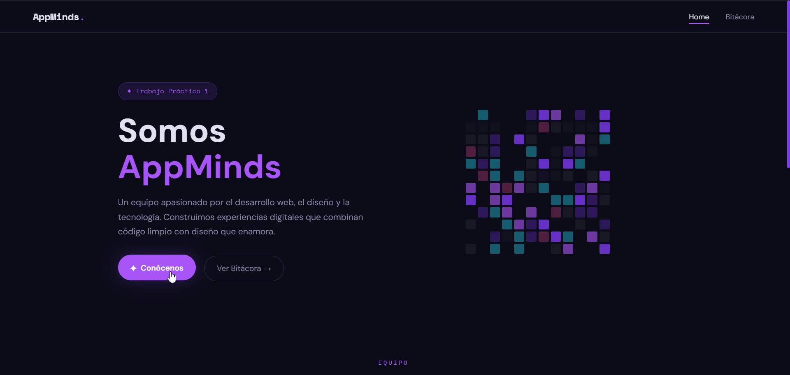
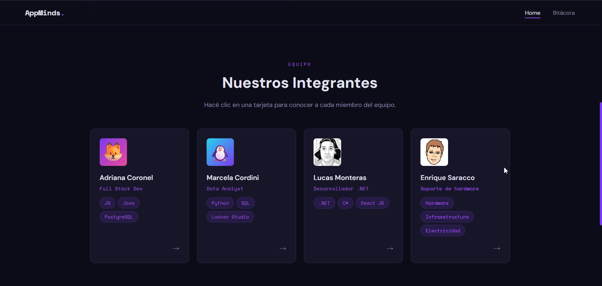
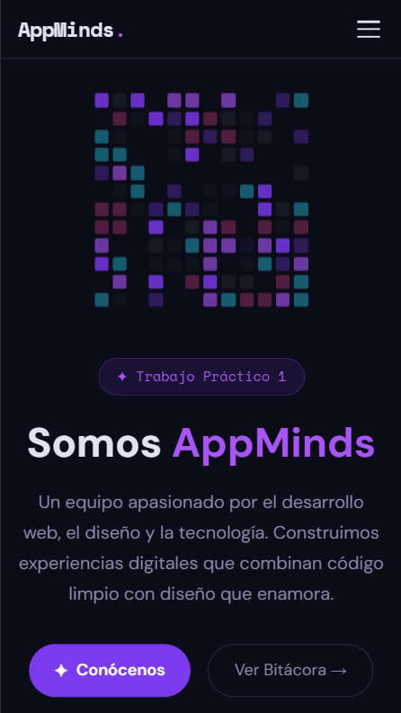
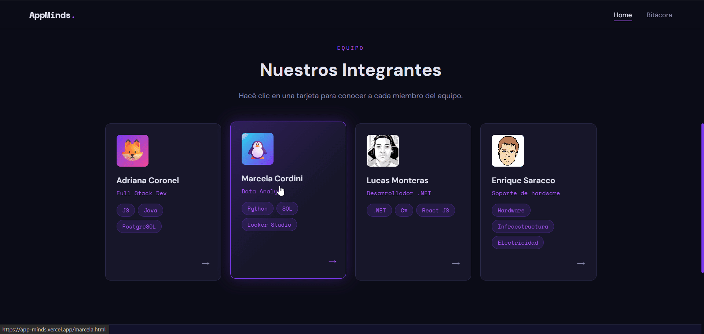
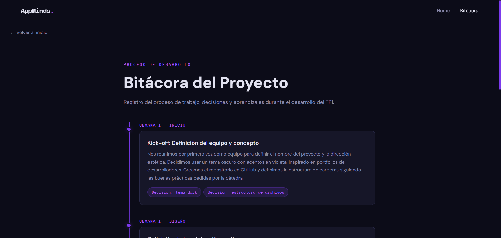
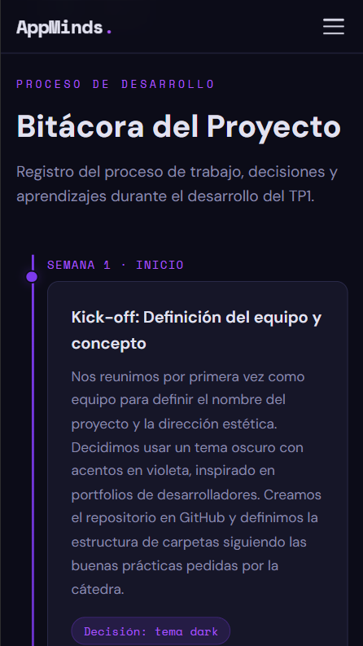

# AppMinds — TP1

**[🚀 Ver sitio en Vercel →](https://app-minds.vercel.app/)**

---

## Descripción del Proyecto

Proyecto web grupal desarrollado para el Trabajo Práctico N°1 de la materia en IFTS N°29. El sitio presenta al equipo AppMinds, con una portada principal, páginas individuales para cada integrante (con foto, datos personales, habilidades, películas y discos favoritos), y una sección de bitácora que documenta el proceso de desarrollo. El objetivo es poner en práctica HTML, CSS y JavaScript puros, con diseño responsive y buenas prácticas de organización de archivos.

---

## Integrantes

| Nombre | GitHub |
|--------|--------|
| Adriana Coronel | [@adco23](https://github.com/adco23) |
| Enrique Saracco | [@ewsaracco](https://github.com/ewsaracco) |
| Lucas Monteras | [@lucasmonteras](https://github.com/lucasmonteras) |
| Marcela Cordini | [@marcelacordini](https://github.com/marcelacordini) |

---

## Tecnologías Utilizadas

- **HTML5** — estructura semántica de todas las páginas
- **CSS3** — estilos, animaciones, variables CSS, Grid y Flexbox
- **JavaScript (ES6+)** — interacciones dinámicas sin frameworks
- **Google Fonts** — Space Mono + DM Sans
- **Vercel** — deploy y hosting
- **GitHub** — control de versiones

---

## Estructura de Archivos

```
/
│
├── index.html          → Portada principal del equipo
├── adriana.html        → Tarjeta individual: Adriana Coronel
├── enrique.html        → Tarjeta individual: Enrique Saracco
├── lucas.html          → Tarjeta individual: Lucas Monteras
├── marcela.html        → Tarjeta individual: Marcela Cordini
├── bitacora.html       → Sección bitácora del proyecto
│
├── css/
│   ├── styles.css      → Estilos globales (navbar, footer, botones, tags)
│   ├── index.css       → Estilos específicos de la portada
│   ├── member.css      → Estilos compartidos de páginas de integrantes
│   └── bitacora.css    → Estilos de la bitácora (timeline)
│
├── js/
│   ├── main.js         → JS global (navbar toggle, skill bars, contadores, toggles)
│   ├── index.js        → JS portada (pixel grid, botón hero)
│   └── member.js       → JS páginas individuales (tabs, age counter, hover)
│
├── img/                → Carpeta reservada para imágenes
│
└── README.md
```

---

## Guía de Estilos

### Paleta de Colores

| Nombre | Hex | Uso |
|--------|-----|-----|
| Background | `#0c0c18` | Fondo principal |
| Background 2 | `#12122a` | Secciones alternadas |
| Card | `#161628` | Tarjetas y cards |
| Border | `#2a2a4a` | Bordes y separadores |
| Purple | `#7c3aed` | Color de acento principal |
| Purple Light | `#a855f7` | Hover, roles, highlights |
| Pink | `#ec4899` | Acento secundario |
| Cyan | `#22d3ee` | Tags especiales |
| Text | `#e2e2f0` | Texto principal |
| Text Muted | `#8888aa` | Texto secundario |

### Tipografías (Google Fonts)

- **Space Mono** — [fonts.google.com/specimen/Space+Mono](https://fonts.google.com/specimen/Space+Mono)  
  Uso: logo, títulos de cards, tags de código, roles, fechas
- **DM Sans** — [fonts.google.com/specimen/DM+Sans](https://fonts.google.com/specimen/DM+Sans)  
  Uso: cuerpo de texto, párrafos, descripciones

### Iconografía

- Se utilizan emojis como iconografía liviana (sin librerías externas)

---

## JavaScript — Funciones Dinámicas

### `index.html` (portada)

| Función | Descripción | Ubicación |
|---------|-------------|-----------|
| `buildPixelGrid()` | Genera una grilla de 12×12 píxeles animados con efecto shimmer en colores del tema | Hero section |
| `btnSurprise click` | Al hacer clic en "Conócenos", muestra mensajes rotativos presentando al equipo | Hero section |
| `animateCounters()` | Cuenta animada desde 0 hasta el valor objetivo al hacer scroll sobre las stats | Sección de estadísticas |

### Integrantes

| Función | Descripción | Ubicación |
|---------|-------------|-----------|
| `animateSkillBars()` | Las barras de habilidades se animan con transición CSS al entrar en el viewport | Sección de skills |
| `.toggle-btn click` | Expande/colapsa la sección "Ver más sobre mí" con animación smooth | Card de perfil |
| `initThemeDots()` | Cambia el color de acento (--purple) del sitio al hacer clic en los puntos de color | Header de perfil |
| `ageBadge counter` | Cuenta animada de 0 hasta la edad del integrante al cargar la página | Badge de edad |
| `media-item hover` | Efecto de desplazamiento suave al hacer hover sobre películas/discos | Listas de media |

---

## Capturas de Pantalla

**Portada Desktop:**




**Portada Mobile:**



**Página Integrante:**


**Bitácora:**



---

## Enlace al Proyecto Desplegado

🔗 **[https://app-minds.vercel.app](https://app-minds.vercel.app/)**

---

## Uso de Inteligencia Artificial

### Herramientas utilizadas

| Herramienta | Modelo | Uso principal |
|-------------|--------|---------------|
| Claude (Anthropic) | Claude Sonnet | Generación de estructura base, debugging CSS, revisión de lógica JS |
| ChatGPT | GPT-4o | Ayuda con redacción de textos de presentación y README |

### Uso en contenido y código

- **Textos:** Las descripciones de integrantes, la bitácora y la sección "Sobre mí" fueron generadas con asistencia de IA y luego editadas por cada integrante.
- **CSS:** La IA ayudó a resolver el bug de responsive en el hero layout (grid 2 cols → 1 col) y a optimizar las transiciones de las barras de habilidades.
- **JS:** La lógica del `IntersectionObserver` para las skill bars y el pixel grid animado fueron desarrollados con asistencia de IA para la estructura base, adaptados al contexto del proyecto.

---
